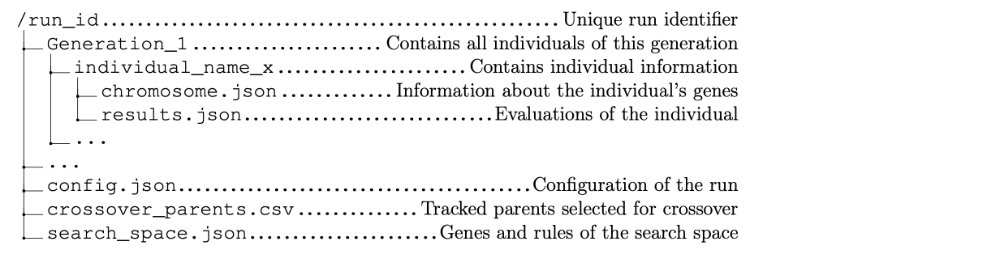

# EvoVis

EvoVis is a dashboard for visualizing Evolutionary Neural Architecture Search (ENAS) algorithms. ENAS is an optimization process that mimics biological evolution to automatically discover optimal neural network architectures for specific tasks. It starts with a population of randomly generated architectures and iteratively improving them through selection, crossover, and mutation. 


EvoVis offers a holistic view of the ENAS process. It provides insights into architectural evolution and performance optimization.The key features of EvoVis are the following:

1. **Hyperparameter Overview:** Efficiently tune hyperparameters with an overview of settings.
2. **Gene Pool Graph:** Visualize potential neural architecture topologies and connectivity patterns across generations.
3. **Family Tree Graph:** Navigate the family tree of architectures, analyze performance metrics, and explore structures.
4. **Performance Plots:** Monitor performance trends in real-time with evolutionary metrics.
5. **Data Structure Interface:** Support for visualizing ENAS results from various frameworks and sources.

## Contents

- [EvoVis](#evovis)
  - [Contents](#contents)
  - [Getting Started](#getting-started)
  - [Compatible ENAS Algorithms](#compatible-enas-algorithms)
  - [Data Structure Interface](#data-structure-interface)
  - [Project Code Organization](#project-code-organization)
  - [License](#license)
  - [Contact](#contact)

## Getting Started

1. **EvoVis Cloning:** Clone the EvoVis repository from [GitHub](https://github.com/leadang42/EvoVis.git) and navigate to the project directory.

````    
git clone https://github.com/leadang42/EvoVis.git
cd EvoVis
````

2. **EvoVis Dependencies:** Install the project's dependencies. This project was developed and tested using Python 3.11.3. While it may work with other versions of Python, compatibility with versions other than 3.11.3 is not guaranteed.
````    
pip3 install -r requirements.txt
````

3. **EvoVis Execution:** Run EvoVis by specifying your run results directory path or use the sample enas run in the enas_example_run_results directory.
````    
python3 EvoVis.py <run_results_path>
````
````
python3 EvoVis.py ./enas_example_run_results
````

4. **EvoVis Usage:** Access EvoVis dashboard via the provided localhost and explore the hyperparameters, gene pool graph, family tree graph, and performance plots.

## Compatible ENAS Algorithms


1. **Gene Pool:** DAG-structured and one searchable level (e.g. no hierarchical search spaces) 
2. **Fitness:** Multi-objective and single-objective fitness functions
3. **Selection:** All strategies
4. **Crossover:** One-point crossover strategy 
5. **Mutation:** All strategies

## Data Structure Interface
In order to visualize ENAS runs with EvoVis, the ENAS algorithm must output a run results directory that follows a specific data structure. See the `enas_example_run_results` directory as an example. Here's an overview of the run results directory structure, followed by a detailed description of the contained files:



**`config.json`**

The JSON file provides the hyperparameters of the ENAS algorithm and the results of measurements conducted on the neural architectures. Additionally, the hyperparameters and results are accompanied by additional settings to modify the EvoVis UI. The only mandatory hyperparameter is `generations`, which defines the number of iterations for an ENAS run. EvoVis relies on this parameter to monitor the ENAS run’s progress.

Settings for the `hyperparameters` in `config.json`
| Key | Description |
| --- | --- |
| `value` | The value of the parameter. (Required) |
| `unit` | The unit of measurement for the parameter. |
| `icon` | The icon representing the parameter from [Iconify](https://icon-sets.iconify.design/). |
| `displayname` | The human-readable name of the parameter. |
| `group` | The category to which the parameter belongs that determines the grouping of the parameters. |
| `description` | A brief description explaining the significance of the parameter. |

Settings for the `results` in `config.json`
| Key | Description |
| --- | --- |
| `displayname` | The human-readable name of the result metric. |
| `unit` | The unit of measurement for the result. |
| `run-result-plot` | Indicates whether to include result in run results page. |
| `individual-info-plot` | Indicates whether to include result in family tree page. |
| `pareto-optimlity-plot` | Indicates whether to include result in the multi-objective mapping plot (fitness function objectives).|
| `individual-info-img` | The image representing the result found in `src/assets/icons` directory. |
| `min-boundary` | The minimum boundary for valid result values. |
| `max-boundary` | The maximum boundary for valid result values. |

**`crossover_parents.csv`**

The CSV file logs crossover events between parent individuals, each represented as a tuple with their names and crossover points. It specifies the resulting new individuals of a newly evolving generation. From the logs the family tree graph is generated. 

**`search_space.json`**

The JSON file serves as the blueprint for generating the gene pool DAG from which the initial population for ENAS is derived. 

| Key | Description |
| --- | --- |
| `gene_pool` | Contains neural network layers categorized into groups based on functionality. Each layer is represented by a unique identifier `layer` and associated parameters. |
| `rule_set` | Specifies which subsequent genes can follow a given gene. The rule set must contain a `Start` which determines the starting point within the gene sequence, influencing the accessibility of subsequent genes. |
| `rule_set_group` | Specifies which subsequent group can follow a given group and therefore facilitates indirect connections between genes based on group associations. |


**`chromosome.json`**

The individual’s chromosome JSON file contains a sequence of genes from the `gene_pool` of the `search_space.json` that encodes the neural architecture.

**`results.json`**

The individual’s result JSON file contains the measurements and fitness of an individual.

| Key | Description |
| --- | --- |
| `fitness` | Stores the fitness from the training process. (Required) |
| `metric` | Stores metrics from the training process. These metrics correspond to the measurements specified in the config.json file. |
| `error` | Indicates whether the individual was successfully trained. If set to true, the individual’s metrics will not be included in the evaluation analysis of the ENAS run. |


## Project Code Organization


## License

EvoVis is licensed under the Apache License. See LICENSE file for details.

## Contact

For any inquiries or support, please contact [lea.van.anh.dang@gmail.com](mailto:lea.van.anh.dang@gmail.com).

---

EvoVis aims to visualize ENAS processes to provide researchers and practitioners with a comprehensive tool for understanding and optimizing neural architectures.
